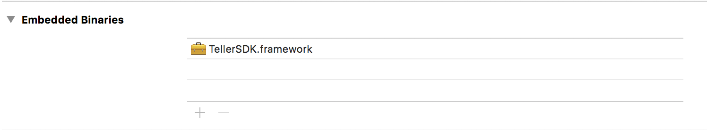

# Teller iOS SDK

**WARNING: This is an ALPHA quality release. Please consider APIs unstable and subject to change!**

The Teller iOS SDK makes it easy to build iOS apps that integrate with the Teller API without having to worry about managing TAuth client TLS certificates or creating the HTTP signatures required by our payments APIs. All you need to worry about is making plain old HTTP calls using your favourite iOS networking library.

## Installation

Drag and drop `TellerSDK.framework` onto **Embedded Binaries** in you app target's **General** settings. This will import the framework and link it with your app.



Register a custom URL scheme in `info.plist` that your app will use for Teller callbacks. Hint: Don't use `teller`, this is used by the Teller iOS app.

CocoaPods and Carthage instructions coming soon.

```xml
<key>CFBundleURLTypes</key>
<array>
  <dict>
    <key>CFBundleURLSchemes</key>
    <array>
      <string>your-app-scheme</string>
    </array>
  </dict>
</array>
<key>TellerCallbackURLScheme</key>
<string>your-app-scheme</string>
<key>LSApplicationQueriesSchemes</key>
<array>
  <string>teller</string>
</array>
```

Set the redirect URL of your application at Teller to be `your-app-scheme://auth`.

## Registration

Registration is managed by `TLRRegistration`. It handles generating private keys and certificate signing requests and manages authenticating the user.

### Example

```obj-c
#import <TellerSDK/TellerSDK.h>

if([TLRRegistration isRegistered]) {
  NSLog(@"Cool beans. User has registered already and you can make requests as them")
} else {
  NSString * applicationId = ...;
  NSDictionary * permissions = @{
    @"balance" : "true",
    @"transaction_history" : "true"
  }

  [TLRRegistration beginRegistrationWithApplicationId:applicationId requestedPermissions:permissions completionHandler:^(TLRRegistration * registration, NSError * error) {
    if(registration) {
    // If the user successfully authenticated themselves and authorised
    // your app, your callback will be invoked with a TLRRegistration instance.

    // -[TLRRegistration token] is a bearer token your backend server can used
    // to make requests on behalf of this user with your server application TAuth
    // certificates.

      NSLog(@"Auth token: %@", registration.token);

    // -[TLRRegistration permissions] are the permissions actually granted by
    // the user. These can be more restrictive than what you asked for.
    // If the user denied a permission your application needs to function,
    // explain this to the user and call this method again to present the
    // permissions dialogue to the user a 2nd time.

    // In general only request permissions your application needs to being with.
    // Always keep in mind that the user is granting you permission to access
    // their bank accounts. This is relatively new behaviour so you might
    // experience some resistance. Request the bare minimum of permissions
    // your app needs initially, demonstrate value, earn trust, and request
    // further permissions as your app *needs* them.

      NSLog(@"User granted permissions: %@", registration.permissions);
    } else {
    // Something went wrong that your application must handle.
      NSLog(@"Error: %@", error);
    }
  }];
}
```

## Client

The Teller iOS SDK provides a simple HTTP client with the bare minimum functionality implemented for use with the Teller API.

### Example

```obj-c
#import <TellerSDK/TellerSDK.h>

[[TLRClient sharedInstance] get:[NSURL URLWithString:@"https://api.teller.io/accounts"] completionBlock:^(NSData *data, NSURLResponse *response, NSError *error) {
  if(error) {
    // Handle ya bidness
    NSLog(@"Error: %@", error);
  } else {
    NSArray * accounts = [NSJSONSerialization JSONObjectWithData:data options:NSJSONReadingMutableContainers error:&error];

    NSLog(@"Bank accounts just like that: %@", accounts);
  }
}];
```

`TLRClient` also exposes a method to make **signed** requests with the user's private key. You're welcome to sign any request you want, but doing so will trigger user auth, e.g. TouchID, FaceID, password. etc. API requests that move money **must** be signed.

```obj-c
#import <TellerSDK/TellerSDK.h>

NSURL * url = // ...
NSDictionary * params = @{
  @"amount" : @"0.01",
  @"account_number" : @"00000000",
  @"bank_code" : @"00-00-00"
};

[[TLRClient sharedInstance] requestWithURL:url withMethod:@"PUT" entity:body signRequest:YES completionBlock:^(NSData *data, NSURLResponse *response, NSError *error) {
  if(error) {
    // Handle ya bidness
    NSLog(@"Error: %@", error);
  } else {
    NSLog(@"Kerching!");
  }
}];

```

## BYO HTTP Client

Everything should **just work** when making requests to the Teller API with your preferred HTTP client if this SDK is loaded by your app. One thing you will have to take care of however is explicitly signing requests

### Example

```obj-c
#import <TellerSDK/TellerSDK.h>

NSURLRequest * request = yourRequest();

request = [TLRRequestSigning signRequest:request];
```

Please contact [help@teller.io](mailto:help@teller.io?subject=Teller%20iOS%20SDK%20support) for support.
